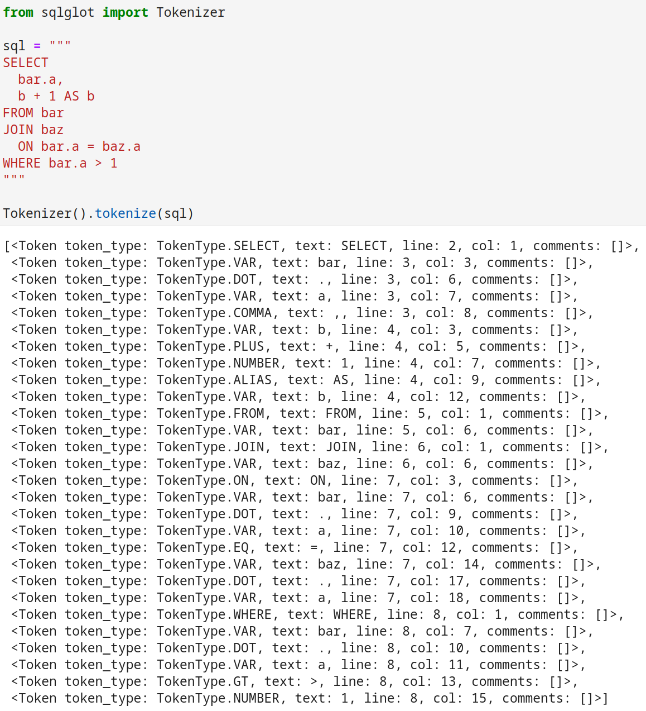
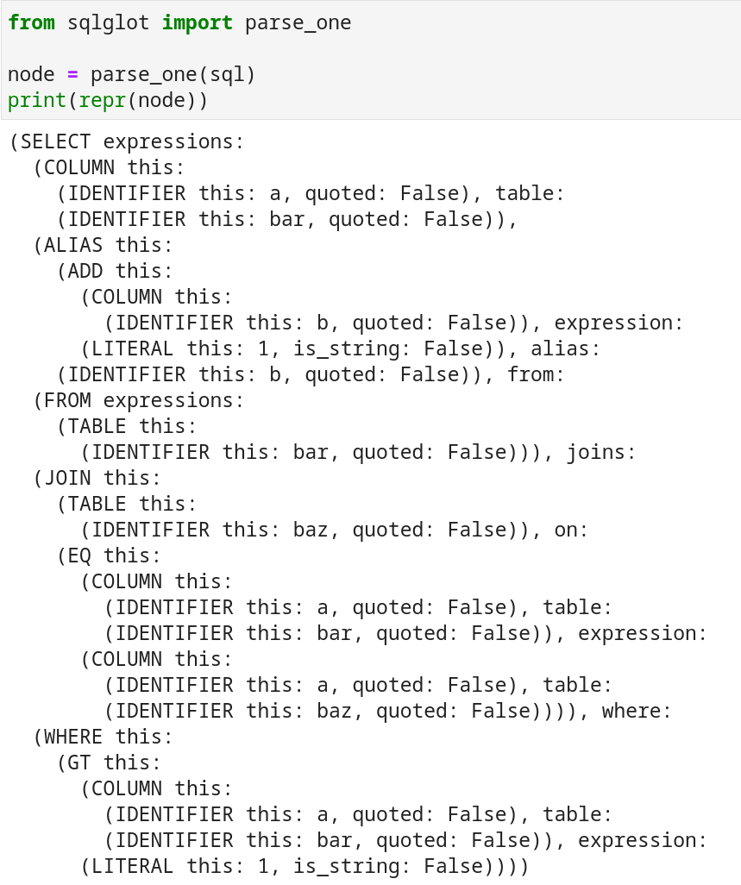
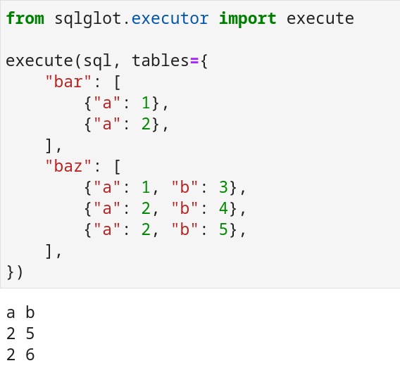

# Writing a Python SQL Engine from Scratch
[Toby Mao](https://www.linkedin.com/in/toby-mao/)

## Introduction

When I first started writing SQLGlot in early 2021, my goal was just to translate SQL queries from SparkSQL to Presto and vice versa. However, over the last year and a half, I've ended up with a full-fledged SQL engine. SQLGlot can now parse and transpile between [18 SQL dialects](https://github.com/tobymao/sqlglot/blob/main/sqlglot/dialects/__init__.py) and can execute all 24 [TPC-H](https://www.tpc.org/tpch/) SQL queries. The parser and engine are all handwritten from scratch with Python.

This post will cover [why](#why) I went through the effort of creating a Python SQL engine and [how](#how) a simple query goes from a string to actually transforming data. The following steps are briefly summarized:

* [Tokenizing](#tokenizing)
* [Parsing](#parsing)
* [Optimizing](#optimizing)
* [Planning](#planning)
* [Executing](#executing)

## Why?
I started working on SQLGlot because of my work on the [experimentation and metrics platform](https://netflixtechblog.com/reimagining-experimentation-analysis-at-netflix-71356393af21) at Netflix, where I built tools that allowed data scientists to define and compute SQL based metrics. Netflix relied on multiple engines to query data (Spark, Presto, and Druid) so my team built the metrics platform around [PyPika](https://github.com/kayak/pypika), a Python SQL query builder so that definitions could be reused across multiple engines. However, it became quickly apparent that writing python code to programatically generate SQL was challenging for data scientists, especially those with academic backgrounds since they were mostly familiar with R and SQL. But at the time, the only Python SQL parser was [sqlparse]([https://github.com/andialbrecht/sqlparse) which is not actually a parser, but a tokenizer, so having users write raw SQL into the platform wasn't really an option. Some time later, I randomly stumbled across [Crafting Interpreters](https://craftinginterpreters.com/) and realized that I could use it as a guide towards creating my on SQL parser / transpiler.

Why did I do this? Isn't a Python SQL engine going to be extremely slow?

The main reason why I ended up building a SQL engine was ... just for **entertainment**. It's been fun learning about all the things required to actually run a SQL query and seeing it actually work is extremely rewarding. Before SQLGlot, I had zero experience with lexers, parsers, or compilers.

In terms of practical use cases, I planned to use the Python SQL engine for unit testing SQL pipelines. Big data pipelines are tough to test because many of the engines are not open source and cannot be run locally. With SQLGlot, you can take a SQL query targeting a warehouse like [Snowflake](https://www.snowflake.com/en/), and seamlessly run it in CI on mock Python data. It's easy to mock data and create arbitrary [UDFs](https://en.wikipedia.org/wiki/User-defined_function) because everything is just Python.  Although the implementation is slow and unsuitable for large amounts of data (> 1 millon rows), there's very little overhead / startup and can run queries on test data in a couple of milliseconds.

Finally, the components that have been built to support execution can be used as a **foundation** for a faster engine. I'm inspired by what [Apache Calcite](https://github.com/apache/calcite) has done for the JVM world. Even though Python is commonly used for data, there hasn't been a Calcite for Python. So you could say that SQLGlot aims to be that framework. For example, it wouldn't take much work to replace the Python execution engine with numpy / pandas / arrow to become a respectably performing query engine. The implementation would be able to leverage the parser, optimizer, and logical planner, only needing to implement physical execution. There is a ton of work in the Python ecosystem around high performance vectorized computation which I think could benefit from a pure Python based [AST](https://en.wikipedia.org/wiki/Abstract_syntax_tree) / [plan](https://en.wikipedia.org/wiki/Query_plan). Parsing and planning doesn't have to be fast when the bottleneck of running queries is processing terabytes of data. So having a Python based ecosystem around SQL is beneficial given the ease of development in Python despite not having bare metal performance.

Parts of SQLGlot's toolkit are being used today by

* [Ibis](https://github.com/ibis-project/ibis): A Python library that provides a lightweight, universal interface for data wrangling.
    - Uses the Python SQL expression builder and leverages the optimizer/planner to convert SQL into dataframe operations
* [mysql-mimic](https://github.com/kelsin/mysql-mimic): Pure-Python implementation of the MySQL server wire protocol
    - Parses / transforms SQL and executes INFORMATION_SCHEMA queries.
* [Quokka](https://github.com/marsupialtail/quokka): Push-based vectorized query engine
    - Parse and optimizes SQL.
* [Splink](https://github.com/moj-analytical-services/splink): Fast, accurate and scalable probabilistic data linkage using your choice of SQL backend.
    - Transpiles queries.

## How?

There are many steps involved with actually running a simple query like:

```sql
SELECT
  bar.a,
  b + 'y' AS b
FROM bar
JOIN baz
  ON bar.a = baz.a
WHERE bar.a > 1
```

In this post, I'll walk through all the steps SQLGlot takes to run this query over Python objects.

## Tokenizing

The first step is to convert the sql string into a list of tokens. SQLGlot's tokenizer is quite simple and can be found [here](https://github.com/tobymao/sqlglot/blob/main/sqlglot/tokens.py). In a while loop, it checks each character and either appends the character to the current token or makes a new token.

Running the SQLGlot tokenizer shows the output.



Each keyword has been converted to a SQLGlot Token object. Each token has some metadata associated with it like line / column information for error messages. Comments are also a part of the token so that comments can be preserved.

## Parsing

Once a SQL statement is tokenized, we don't need to worry about white space and other formatting, so it's easier to work with. We can now convert the list of tokens into an AST. The SQLGlot [parser](https://github.com/tobymao/sqlglot/blob/main/sqlglot/parser.py) is a hand written [recursive descent](https://en.wikipedia.org/wiki/Recursive_descent_parser) parser.

Similar to the tokenizer, it consumes the tokens sequentially but it uses a recursive algorithm instead. The tokens are converted into a single AST node which presents the SQL query. The SQLGlot parser was designed to support various dialects so it contains many options for overriding parsing functionality.



The AST is a generic representation of a given SQL query. Each dialect can override or implement its own generator that can convert an AST object into syntatically correct SQL.

## Optimizing

Once we have our AST, we can transform it into an equivalent query that would produce the same results more efficiently. When optimizing queries, most engines first convert the AST into a logical plan and then optimize the plan. However, I chose to **optimize the AST directly** for two reasons.

1. It's easier to debug and [validate](https://github.com/tobymao/sqlglot/blob/main/tests/fixtures/optimizer) the optimizations when the input and output are both SQL.

2. Rules can be applied a la carte transforming SQL into a more desireable form.

3. I wanted a way to generate 'canonical sql'. Having a canonical representation of SQL is useful for understanding if two queries are semantically equivalent (eg. `SELECT 1 + 1` and  `SELECT 2`).

I've yet to find another engine that takes this approach, but I'm quite happy with this decision. The optimizer currently does not perform any "physical optimizations" like join reordering. Those are left to the execution layer as additional statistics and information could become relevant.


The optimizer currently has [17 rules](https://github.com/tobymao/sqlglot/tree/main/sqlglot/optimizer). Each of these rules is applied, transforming the AST in place. The combination of these rules creates "canonical" sql which can then be more easily converted into a logical plan and then executed.

Some example rules are:

### qualify\_tables and qualify_columns
- Adds all db/catalog qualifiers to tables and forces an alias.
- Ensure each column is unambiguous and expand stars.

```sql
SELECT * FROM x`;

SELECT "db"."x" AS "x";
```

### simplify
Boolean and math simplification. Check out all the [test cases](https://github.com/tobymao/sqlglot/blob/main/tests/fixtures/optimizer/simplify.sql).

```sql
((NOT FALSE) AND (x = x)) AND (TRUE OR 1 <> 3);
x = x;

1 + 1;
2;
```

### normalize
Attempts to convert all predicates into [conjunctive normal form](https://en.wikipedia.org/wiki/Conjunctive_normal_form).

```sql
-- DNF
(A AND B) OR (B AND C AND D);

-- CNF
(A OR C) AND (A OR D) AND B;
```

### unnest\_subqueries
Converts subqueries in predicates into joins.

```sql
-- The subquery can be converted into a left join
SELECT *
FROM x AS x
WHERE (
  SELECT y.a AS a
  FROM y AS y
  WHERE x.a = y.a
) = 1;

SELECT *
FROM x AS x
LEFT JOIN (
  SELECT y.a AS a
  FROM y AS y
  WHERE TRUE
  GROUP BY y.a
) AS "_u_0"
  ON x.a = "_u_0".a
WHERE ("_u_0".a = 1 AND NOT "_u_0".a IS NULL)'
```

### pushdown_predicates
Push down filters into the innermost query.
```sql
SELECT *
FROM (
  SELECT *
  FROM x AS x
) AS y
WHERE y.a = 1;

SELECT *
FROM (
  SELECT *
  FROM x AS x
  WHERE y.a = 1
) AS y WHERE TRUE
```

### annotate_types
Infer all types throughout the AST given schema information and function type definitions.

## Planning
After the SQL AST has been "optimized", it's much easier to [convert into a logical plan](https://github.com/tobymao/sqlglot/blob/main/sqlglot/planner.py). The AST is traversed and converted into a [DAG](https://en.wikipedia.org/wiki/Directed_acyclic_graph) consisting of one of five steps. The different types of steps are:

### Scan
Selects columns from a table, applies projections, and finally filters the table.

### Sort
Sorts a table for order by expressions.

### Set
Applies the operators union / union all / except / intersect.

### Aggregate
Applies an aggregation / group by.

### Join
Joins multiple tables together.


The logical plan is quite simple and contains the information required to convert it into a physical plan (execution).

## Executing
Finally, we can actually execute the SQL query. The [Python engine](https://github.com/tobymao/sqlglot/blob/toby/post/sqlglot/executor/python.py) is not fast, but it's very small (~400 LOC)! It iterates the DAG with a queue and runs each step, passing each intermediary table to the next step.

In order to keep things simple, it evaluates expressions with `eval`. Because SQLGlot was built primarily to be a transpiler, it was simple to create a "Python SQL" dialect. So a SQL expression `x + 1` can just be converted into `scope['x'] + 1`.



## What's Next
SQLGlot's main focus will always be on parsing / transpiling, but I plan to continue development on the execution engine. I'd like to pass [TPC-DS](https://www.tpc.org/tpcds/). If someone doesn't beat me to it, I may even take a stab at writing a Pandas / Arrow execution engine.

## Special Thanks
SQLGlot would not be what it is without it's core contributors. In particular, the execution engine would not exist without [Barak Alon](https://github.com/barakalon) and [George Sittas](https://github.com/GeorgeSittas).

## Get in Touch
If you'd like to chat more about SQLGlot, please join my [Slack Channel](https://join.slack.com/t/tobiko-data/shared_invite/zt-1ma66d79v-a4dbf4DUpLAQJ8ptQrJygg)!
